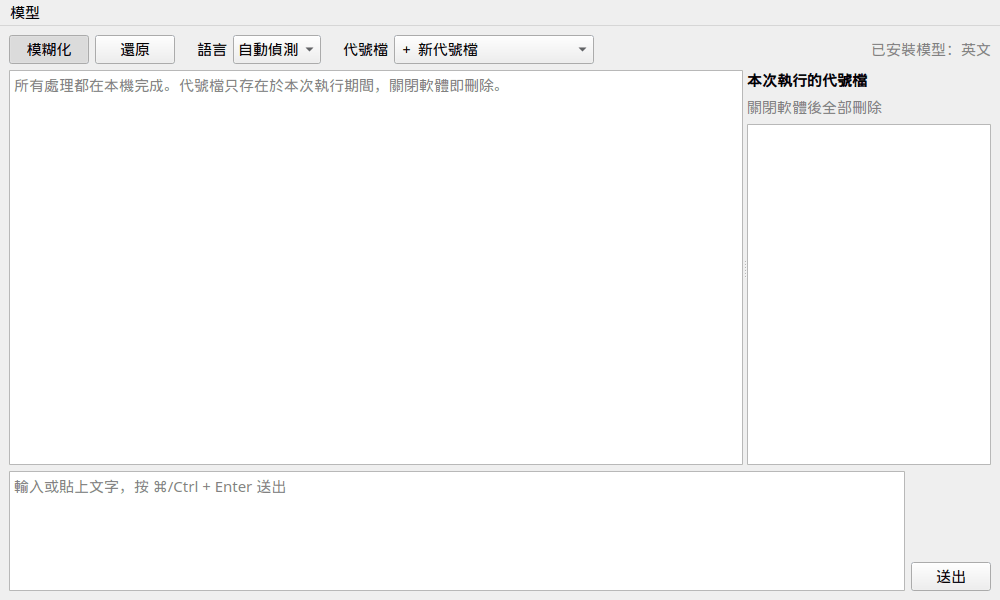
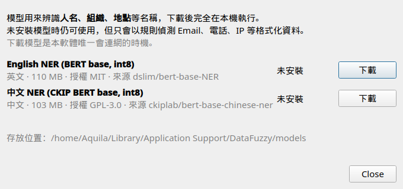
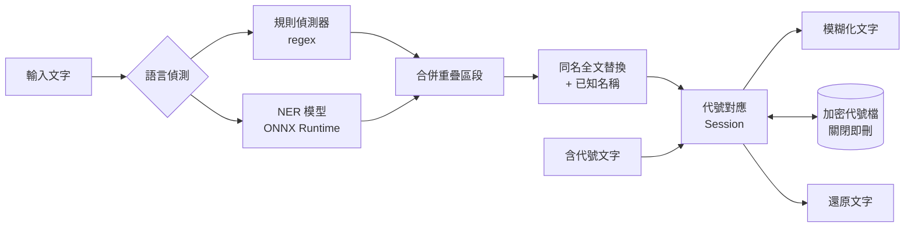

# DataFuzzy

[](https://github.com/AquilaWei/DataFuzzy/actions/workflows/ci.yml)
[](https://codecov.io/gh/AquilaWei/DataFuzzy)


[](LICENSE)

**在本機把文字中的機敏資訊換成代號，之後再一鍵換回來。** 適合把內容貼給外部 AI 或同事之前先「去識別化」。



## ✨ 功能

- 🔒 **完全本機處理** — 文字不會離開你的電腦
- 🏷️ **可還原的代號** — `alice@acme.com` → `[EMAIL_A]`；同一個值永遠是同一個代號
- 🔁 **跨文本還原** — 貼回任何含代號的新文字，選擇代號檔即可換回原文
- 🧹 **關閉即刪除** — 代號檔加密暫存，軟體關閉（或被中止）時全部刪除
- 🧠 **名稱辨識** — 本機 NER 模型辨識人名、組織、地點；同一名稱在全文與後續輸入都換成同一代號
- 🌏 **中英文** — 自動偵測語言；目前提供英文模型，中文模型規劃中（見 [Roadmap](#-roadmap)）

目前可偵測：

| 類別 | 代號 | 範例 |
|---|---|---|
| 人名 | `PERSON` | `John Smith`、`Wei-Chuang Huang`（需安裝模型） |
| 組織 | `ORG` | `Acme Corporation`（需安裝模型） |
| 地點 | `LOC` | `Berlin`、`San Francisco`（需安裝模型） |
| Email | `EMAIL` | `bob@corp.io` |
| 電話 | `PHONE` | `0912-345-678`、`+886 912 345 678`、`(02) 2345-6789` |
| 身分證字號 | `TWID` | `A123456789`（驗證檢查碼） |
| 信用卡 | `CARD` | `4111 1111 1111 1111`（Luhn 驗證） |
| IP | `IP` | `10.0.0.8`、`2001:db8::1` |
| 網址 | `URL` | `https://intra.corp.local/wiki` |
| 密碼 / 金鑰 | `SECRET` | `密碼：xxx`、`sk-…`、`AKIA…`、JWT |

## 🚀 快速開始

**需求：** Python 3.12+、[uv](https://docs.astral.sh/uv/)

```bash
git clone https://github.com/AquilaWei/DataFuzzy.git
cd DataFuzzy
uv sync
uv run datafuzzy
```

**第一次啟動**會跳出「模型管理」，按 **下載** 取得英文模型（約 110 MB，只需一次）。之後可從選單 **模型 → 模型管理…** 新增或刪除。不下載也能用，只是人名等名稱不會被替換。



| 環境變數 | 用途 | 預設 |
|---|---|---|
| `DATAFUZZY_MODELS_DIR` | 模型存放位置 | macOS `~/Library/Application Support/DataFuzzy/models`<br>Linux `~/.local/share/DataFuzzy/models` |

> Mac 安裝檔（`.dmg`）將於 0.5.0 提供。

## 📖 使用方式

1. **模糊化**：選「模糊化」→ 代號檔選「＋ 新代號檔」→ 貼上文字 → **⌘/Ctrl + Enter**
   ```
   Hi Maria, please ask John Smith at Acme Corporation to email john.smith@acme.com
   → Hi [PERSON_A], please ask [PERSON_B] at [ORG_A] to email [EMAIL_A]
   ```
2. **還原**：選「還原」→ 選要用的代號檔 → 貼上含代號的文字
   ```
   [PERSON_A] told [PERSON_B] that [ORG_A] approved it
   → Maria told John Smith that Acme Corporation approved it
   ```
3. 點回覆旁的 **複製** 即可取用結果。

## 🛡️ 隱私與安全

- 所有偵測與替換都在本機執行；**唯一會連網的是你按下「下載模型」時**
- 模型直接從 Hugging Face 原發佈者下載，鎖定固定版本並以 SHA-256 驗證
- 代號檔存於系統暫存目錄 `datafuzzy-<pid>/`，以 **AES-256-GCM** 加密，金鑰只存在記憶體
- 關閉視窗、`Ctrl+C`、`SIGTERM` 都會刪除代號檔；若程式被強制結束，下次啟動時自動清除殘留

## ⚠️ 已知限制

- 英文模型區分大小寫：全小寫的名字（`john smith`）可能漏掉
- 單獨出現的名或姓會沿用全名的代號（`John Smith`、`John` → `[PERSON_A]`），還原時一律還原成全名；一個名字一旦在代號檔中連到某人，之後出現同名的另一人也不會改變
- 中文名字（`王小明` ↔ `小明`）尚未連結
- 產品名稱偶爾會被當成人名或組織而替換（寧可多遮，不要漏遮）

## 🏗️ 架構



```
src/datafuzzy/
├── core/            # 與 UI 無關的邏輯
│   ├── detect/      # 偵測器：regex、NER（ONNX）
│   ├── models/      # 模型清單、下載、驗證
│   ├── mapping.py   # 代號產生與還原
│   ├── store.py     # 加密暫存與清除
│   └── pipeline.py  # 串接偵測與代號
├── ui/              # PySide6 介面
└── models_manifest.json  # 可下載的模型（網址、大小、SHA-256）
```

## 🗺️ Roadmap

- [x] 0.1 — 規則偵測、代號對應、加密暫存、對話介面
- [x] 0.2 — 模型下載管理 + 英文 NER（`dslim/bert-base-NER`）
- [ ] 0.3 — 中文 NER（`ckiplab/bert-base-chinese-ner`）
- [ ] 0.4 — 代號檔管理（命名、預覽、自動推薦）
- [ ] 0.5 — Mac `.dmg` / Linux AppImage（不含模型，安裝後下載）

## 🤝 參與貢獻

```bash
uv sync                  # 安裝含開發工具的環境
uv run pytest            # 執行測試
tools/test_arm64.sh      # 在 arm64 + 8GB 限制的容器中測試（模擬 Apple Silicon）
uv run tools/update_manifest.py  # 更新模型版本後重新產生 models_manifest.json
```

模型相關測試需要本機有英文模型（在 App 內下載，或先跑 `tools/update_manifest.py`），否則會自動略過；CI 一定會下載並執行。

- **Commit 格式：** `<type>: <description>`（英文），type 為 `feat` `fix` `docs` `style` `refactor` `perf` `test` `chore`
- **版號：** `MAJOR.MINOR.PATCH` — 新功能測試通過升 MINOR，bug 修正升 PATCH；變更記錄於 [CHANGELOG](CHANGELOG.md)

## 📄 授權

本專案採用 [GPL-3.0](LICENSE)。

| 模型 | 授權 | 下載來源（int8 ONNX） |
|---|---|---|
| [`dslim/bert-base-NER`](https://huggingface.co/dslim/bert-base-NER) | MIT | [`Xenova/bert-base-NER`](https://huggingface.co/Xenova/bert-base-NER) |
| [`ckiplab/bert-base-chinese-ner`](https://huggingface.co/ckiplab/bert-base-chinese-ner)（規劃中） | GPL-3.0，© CKIP Lab | [`Xenova/bert-base-chinese-ner`](https://huggingface.co/Xenova/bert-base-chinese-ner) |

模型不隨程式散布，由使用者在 App 內自行下載。
