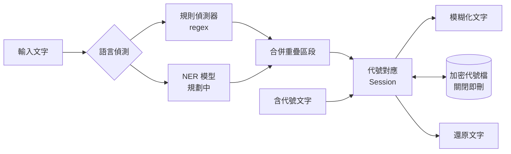

# DataFuzzy

[](https://github.com/AquilaWei/DataFuzzy/actions/workflows/ci.yml)
[](https://codecov.io/gh/AquilaWei/DataFuzzy)


[](LICENSE)

**在本機把文字中的機敏資訊換成代號，之後再一鍵換回來。** 適合把內容貼給外部 AI 或同事之前先「去識別化」。


## ✨ 功能

- 🔒 **完全本機處理** — 文字不會離開你的電腦
- 🏷️ **可還原的代號** — `alice@acme.com` → `[EMAIL_A]`；同一個值永遠是同一個代號
- 🔁 **跨文本還原** — 貼回任何含代號的新文字，選擇代號檔即可換回原文
- 🧹 **關閉即刪除** — 代號檔加密暫存，軟體關閉（或被中止）時全部刪除
- 🌏 **中英文** — 自動偵測語言；NER 模型支援規劃中（見 [Roadmap](#-roadmap)）

目前可偵測：

| 類別 | 代號 | 範例 |
|---|---|---|
| Email | `EMAIL` | `bob@corp.io` |
| 電話 | `PHONE` | `0912-345-678`、`+886 912 345 678`、`(02) 2345-6789` |
| 身分證字號 | `TWID` | `A123456789`（驗證檢查碼） |
| 信用卡 | `CARD` | `4111 1111 1111 1111`（Luhn 驗證） |
| IP | `IP` | `10.0.0.8`、`2001:db8::1` |
| 網址 | `URL` | `https://intra.corp.local/wiki` |
| 密碼 / 金鑰 | `SECRET` | `密碼：xxx`、`sk-…`、`AKIA…`、JWT |

## 🚀 快速開始

**需求：** Python 3.12+、[uv](https://docs.astral.sh/uv/)

```bash
git clone https://github.com/AquilaWei/DataFuzzy.git
cd DataFuzzy
uv sync
uv run datafuzzy
```

> Mac 安裝檔（`.dmg`）將於 0.5.0 提供。

## 📖 使用方式

1. **模糊化**：選「模糊化」→ 代號檔選「＋ 新代號檔」→ 貼上文字 → **⌘/Ctrl + Enter**
   ```
   請把合約寄給 alice.chen@acme.com.tw，VPN 主機 10.20.30.40
   → 請把合約寄給 [EMAIL_A]，VPN 主機 [IP_A]
   ```
2. **還原**：選「還原」→ 選要用的代號檔 → 貼上含代號的文字
   ```
   已回覆 [EMAIL_A]，請從 [IP_A] 登入
   → 已回覆 alice.chen@acme.com.tw，請從 10.20.30.40 登入
   ```
3. 點回覆旁的 **複製** 即可取用結果。

## 🛡️ 隱私與安全

- 所有偵測與替換都在本機執行，不連網
- 代號檔存於系統暫存目錄 `datafuzzy-<pid>/`，以 **AES-256-GCM** 加密，金鑰只存在記憶體
- 關閉視窗、`Ctrl+C`、`SIGTERM` 都會刪除代號檔；若程式被強制結束，下次啟動時自動清除殘留

## 🏗️ 架構



```
src/datafuzzy/
├── core/            # 與 UI 無關的邏輯
│   ├── detect/      # 偵測器（regex，之後加 NER）
│   ├── mapping.py   # 代號產生與還原
│   ├── store.py     # 加密暫存與清除
│   └── pipeline.py  # 串接偵測與代號
└── ui/              # PySide6 介面
```

## 🗺️ Roadmap

- [x] 0.1 — 規則偵測、代號對應、加密暫存、對話介面
- [ ] 0.2 — 模型下載管理 + 英文 NER（`dslim/bert-base-NER`）
- [ ] 0.3 — 中文 NER（`ckiplab/bert-base-chinese-ner`）
- [ ] 0.4 — 代號檔管理（命名、預覽、自動推薦）
- [ ] 0.5 — Mac `.dmg` / Linux AppImage（不含模型，安裝後下載）

## 🤝 參與貢獻

```bash
uv sync                  # 安裝含開發工具的環境
uv run pytest            # 執行測試
tools/test_arm64.sh      # 在 arm64 + 8GB 限制的容器中測試（模擬 Apple Silicon）
```

- **Commit 格式：** `<type>: <description>`（英文），type 為 `feat` `fix` `docs` `style` `refactor` `perf` `test` `chore`
- **版號：** `MAJOR.MINOR.PATCH` — 新功能測試通過升 MINOR，bug 修正升 PATCH；變更記錄於 [CHANGELOG](CHANGELOG.md)

## 📄 授權

本專案採用 [GPL-3.0](LICENSE)。

規劃使用的模型：`dslim/bert-base-NER`（MIT）、`ckiplab/bert-base-chinese-ner`（GPL-3.0，© CKIP Lab）。
