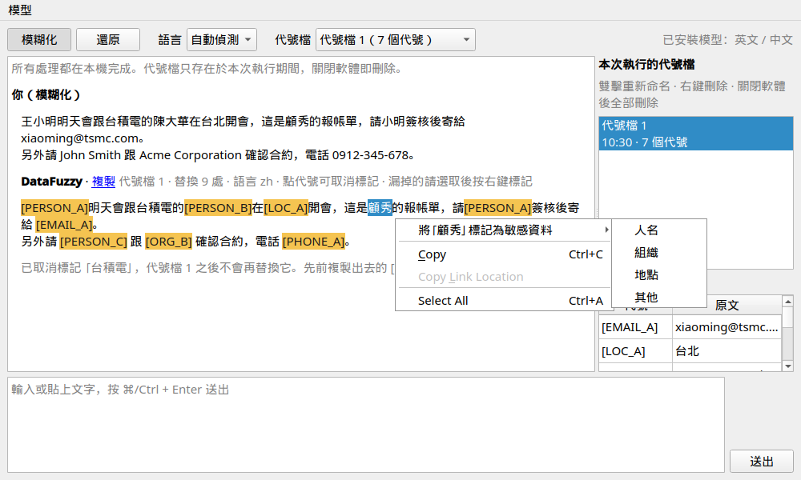
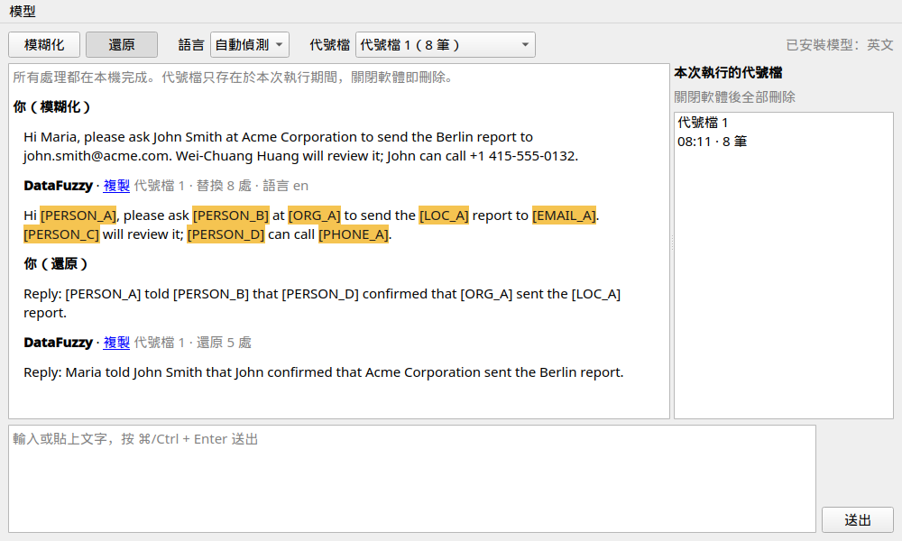
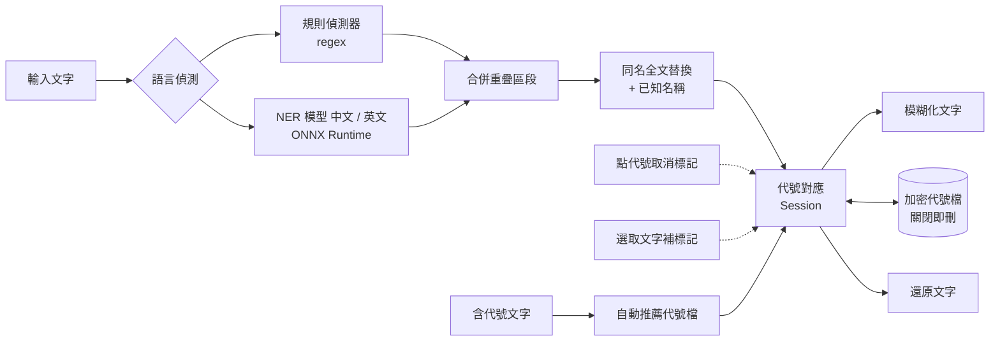

# DataFuzzy

[](https://github.com/AquilaWei/DataFuzzy/actions/workflows/ci.yml)
[](https://codecov.io/gh/AquilaWei/DataFuzzy)


[](LICENSE)

**在本機把文字中的機敏資訊換成代號，之後再一鍵換回來。** 適合把內容貼給外部 AI 或同事之前先「去識別化」。


## ✨ 功能

- 🔒 **完全本機處理** — 文字不會離開你的電腦
- 🏷️ **可還原的代號** — `alice@acme.com` → `[EMAIL_A]`；同一個值永遠是同一個代號
- 🔁 **跨文本還原** — 貼回任何含代號的新文字，自動選出對應的代號檔並換回原文
- 🗂️ **代號檔管理** — 命名、預覽對應表、刪除；誤判的代號點一下就能取消標記
- ✍️ **手動補標記** — 模型漏掉的名字，選取後按右鍵就能標記，所有回覆與之後的輸入都會替換
- 🧹 **關閉即刪除** — 代號檔加密暫存，軟體關閉（或被中止）時全部刪除
- 🧠 **名稱辨識** — 本機 NER 模型辨識人名、組織、地點；同一名稱在全文與後續輸入都換成同一代號
- 🎯 **人名優先** — 人名採較寬的門檻，中文逐句再檢查一次；聊天紀錄（`張明：好的`、LINE 匯出）的說話者也會一併代號化。測試集人名召回率約 98%（中文）/ 100%（英文）
- 🌏 **中英文** — 中文、英文各一個模型；中英混合的文字會同時用兩個模型

目前可偵測：

| 類別 | 代號 | 範例 |
|---|---|---|
| 人名 | `PERSON` | `王小明`、`歐陽娜娜`、`John Smith`、`Wei-Chuang Huang`（需安裝模型） |
| 組織 | `ORG` | `台積電`、`Acme Corporation`（需安裝模型） |
| 地點 | `LOC` | `台北`、`San Francisco`（需安裝模型） |
| 台灣地址 | `LOC` | `桃園市中壢區中央西路二段 76 號 3 樓`（需有門牌號碼） |
| 美國地址 | `LOC` | `742 Maple Grove Avenue, Apt 3B, Austin, TX 78704`（需有門牌號碼） |
| Email | `EMAIL` | `bob@corp.io` |
| 電話 | `PHONE` | `0912-345-678`、`+886 912 345 678`、`(02) 2345-6789` |
| 身分證字號 | `TWID` | `A123456789`（驗證檢查碼） |
| 美國社會安全碼 | `SSN` | `219-09-9999`（排除無效號段） |
| 信用卡 | `CARD` | `4111 1111 1111 1111`（Luhn 驗證） |
| IP | `IP` | `10.0.0.8`、`2001:db8::1` |
| 網址 | `URL` | `https://intra.corp.local/wiki` |
| 密碼 / 金鑰 | `SECRET` | `密碼：xxx`、`sk-…`、`AKIA…`、JWT |

## 🚀 快速開始

### 安裝檔（一般使用者）

到 [**Releases**](https://github.com/AquilaWei/DataFuzzy/releases/latest) 下載：

| 平台 | 檔案 | 安裝 |
|---|---|---|
| **macOS 14+**（Apple Silicon） | `DataFuzzy-x.y.z-arm64.dmg` | 打開 `.dmg` → 把 **DataFuzzy** 拖進「應用程式」 |
| **Linux**（x86_64） | `DataFuzzy-x.y.z-x86_64.AppImage` | `chmod +x DataFuzzy-*.AppImage && ./DataFuzzy-*.AppImage` |

- **Mac 第一次開啟**：App 沒有 Apple 付費簽章，macOS 會擋下並顯示「無法驗證」。到 **系統設定 → 隱私權與安全性**，在下方按 **強制打開**（只需一次）。或在終端機執行：
  ```bash
  xattr -dr com.apple.quarantine /Applications/DataFuzzy.app
  ```
- **Linux**：若系統沒有 FUSE，改用 `./DataFuzzy-*.AppImage --appimage-extract-and-run`
- 安裝檔**不含模型**；下載的 `SHA256SUMS.txt` 可用來驗證檔案

### 從原始碼執行（開發者）

**需求：** Python 3.12+、[uv](https://docs.astral.sh/uv/)

```bash
git clone https://github.com/AquilaWei/DataFuzzy.git
cd DataFuzzy
uv sync
uv run datafuzzy
```

**第一次啟動**會跳出「模型管理」，按 **下載** 取得中文（約 103 MB）與英文（約 110 MB）模型，只需一次。之後可從選單 **模型 → 模型管理…** 新增或刪除。不下載也能用，只是人名等名稱不會被替換。


| 環境變數 | 用途 | 預設 |
|---|---|---|
| `DATAFUZZY_MODELS_DIR` | 模型存放位置 | macOS `~/Library/Application Support/DataFuzzy/models`<br>Linux `~/.local/share/DataFuzzy/models` |

## 📖 使用方式

1. **模糊化**：選「模糊化」→ 代號檔選「＋ 新代號檔」→ 貼上文字 → **⌘/Ctrl + Enter**
   ```
   王小明明天跟台積電的陳大華開會，會後小明再寄信給 John Smith
   → [PERSON_A]明天跟[ORG_A]的[PERSON_B]開會，會後[PERSON_A]再寄信給 [PERSON_C]
   ```
2. **還原**：選「還原」→ 貼上含代號的文字（會自動選出能還原最多代號的代號檔，也可手動改選）
   ```
   [PERSON_A] 已與 [PERSON_C] 確認
   → 王小明 已與 John Smith 確認
   ```
3. 點回覆旁的 **複製** 即可取用結果。
4. **誤判**：點回覆中的代號 →「取消標記」，原文會放回所有回覆，這個代號檔之後也不再替換它；先前已複製出去的代號仍可還原
5. **漏掉**：在回覆中 **選取** 漏掉的文字 → **右鍵** →「標記為敏感資料」→ 人名 / 組織 / 地點 / 其他。這個代號檔的所有回覆立即替換，之後的輸入也會自動替換；標記人名時，單獨出現的名（`美玲`）也一併替換

   
6. **管理代號檔**：右側清單 **雙擊** 重新命名、**右鍵** 刪除，下方預覽「代號 ↔ 原文」對應表



**語言**選「自動偵測」時，文字含中文就用中文模型、含英文就用英文模型，混合時兩個都用；手動選 English / 中文 則只用該語言的模型。

## 🛡️ 隱私與安全

- 所有偵測與替換都在本機執行；**唯一會連網的是你按下「下載模型」時**
- 模型直接從 Hugging Face 原發佈者下載，鎖定固定版本並以 SHA-256 驗證
- 代號檔存於系統暫存目錄 `datafuzzy-<pid>/`，以 **AES-256-GCM** 加密，金鑰只存在記憶體
- 關閉視窗、`Ctrl+C`、`SIGTERM` 都會刪除代號檔；若程式被強制結束，下次啟動時自動清除殘留

## ⚠️ 已知限制

- 英文模型區分大小寫：全小寫的名字（`john smith`）可能漏掉
- 單獨出現的名或姓會沿用全名的代號（`John Smith`、`John` → `[PERSON_A]`；`王小明`、`小明` → `[PERSON_A]`），還原時一律還原成全名；一個名字一旦在代號檔中連到某人，之後出現同名的另一人也不會改變
- 中文只連結「名」，單獨的姓（`王先生`）不連結；中文模型以繁體中文訓練，簡體中文效果可能較差
- 產品名稱偶爾會被當成人名或組織而替換（寧可多遮，不要漏遮），可點代號取消標記
- 人名仍可能漏掉（約 1–2%，多為少見的兩字名）、長句中的地名偶爾會漏掉：送出前請快速看一下，漏掉的選取後按右鍵補標記

## 🏗️ 架構



```
src/datafuzzy/
├── core/            # 與 UI 無關的邏輯
│   ├── detect/      # 偵測器：regex、NER（ONNX）
│   ├── models/      # 模型清單、下載、驗證
│   ├── mapping.py   # 代號產生與還原
│   ├── store.py     # 加密暫存與清除
│   └── pipeline.py  # 串接偵測與代號
├── ui/              # PySide6 介面
└── models_manifest.json  # 可下載的模型（網址、大小、SHA-256）
packaging/           # PyInstaller 設定、.dmg / AppImage 打包、第三方授權清單
```

## 🗺️ Roadmap

- [x] 0.1 — 規則偵測、代號對應、加密暫存、對話介面
- [x] 0.2 — 模型下載管理 + 英文 NER（`dslim/bert-base-NER`）
- [x] 0.3 — 中文 NER（`ckiplab/bert-base-chinese-ner`）、中英混合文字
- [x] 0.4 — 代號檔管理（命名、預覽、自動推薦）、誤判取消標記
- [x] 0.5 — 手動補標記漏掉的名字、人名召回率提升
- [ ] 0.6 — Mac `.dmg` / Linux AppImage（不含模型，安裝後下載），推 tag 自動發佈；0.5.1 為測試版，M2 實機驗收後發佈 0.6

## 🤝 參與貢獻

```bash
uv sync                  # 安裝含開發工具的環境
uv run pytest            # 執行測試
tools/test_arm64.sh      # 在 arm64 + 8GB 限制的容器中測試（模擬 Apple Silicon）
uv run tools/update_manifest.py  # 更新模型版本後重新產生 models_manifest.json
packaging/build_appimage.sh      # 打包 Linux AppImage → dist/
packaging/build_dmg.sh           # 打包 Mac .dmg（需在 macOS 上執行）→ dist/
```

**發佈：** 推送 tag `vX.Y.Z` 後，GitHub Actions 會在 macOS（Apple Silicon）與 Ubuntu 22.04 上打包，用真實模型跑 `--self-test` 驗證安裝檔，再建立 GitHub Release。

模型相關測試需要本機有對應的模型（在 App 內下載，或先跑 `tools/update_manifest.py`），否則會自動略過；CI 一定會下載並執行。

- **Commit 格式：** `<type>: <description>`（英文），type 為 `feat` `fix` `docs` `style` `refactor` `perf` `test` `chore`
- **版號：** `MAJOR.MINOR.PATCH` — 新功能測試通過升 MINOR，bug 修正升 PATCH；變更記錄於 [CHANGELOG](CHANGELOG.md)

## 📄 授權

本專案採用 [GPL-3.0](LICENSE)。

| 模型 | 授權 | 下載來源（int8 ONNX） |
|---|---|---|
| [`dslim/bert-base-NER`](https://huggingface.co/dslim/bert-base-NER) | MIT | [`Xenova/bert-base-NER`](https://huggingface.co/Xenova/bert-base-NER) |
| [`ckiplab/bert-base-chinese-ner`](https://huggingface.co/ckiplab/bert-base-chinese-ner) | GPL-3.0，© CKIP Lab | [`Xenova/bert-base-chinese-ner`](https://huggingface.co/Xenova/bert-base-chinese-ner) |

模型不隨程式散布，由使用者在 App 內自行下載。安裝檔內附的第三方套件授權（Qt 以 LGPL-3.0 動態連結）可在 App 的 **說明 → 關於 DataFuzzy** 查看。
